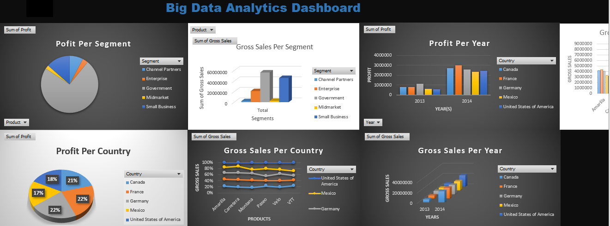

# **Business Performance Dashboard**

This project focuses on analyzing profits and sales across different segments. The dashboard visualizes key business metrics such as **Profit, Sales, Units Sold, Products, Countries, and Segments over time**.  
The main goal is to provide clear insights into business performance, enabling decision-makers and stakeholders to identify growth opportunities and make better strategic decisions.

## **Excel Dashboard**

## **Objectives**

- **Present and clarify performance** across multiple metrics (**Profit, Sales, Units Sold, Products, Segments, Years, and Countries**). 
- **Use relevant charts and visuals** to highlight performance trends across products, years, and segments.  
- **Support better decision-making** through data-driven insights. 

## **Key Questions Answered**

- **Profit per Segment**  
- **Gross Sales per Segment**  
- **Profit per Country**  
- **Profit per Year**  
- **Gross Sales Per Year**  
- **Gross Sales Per Product Per Country**  
- **Profit Per Product Per Country Per Year**  
- **Profit Per Product Per Segment Per Year**  
- **Units Sold Per Year**

## **Conclusion**

This project demonstrates how **Excel** can be used as a powerful tool for data analytics. With features like **What-If Analysis, Goal Seek, and Solver**, Excel makes it simple to explore and visualize large data sets while answering key business questions.  
By using these tools effectively, this dashboard provides valuable insights into performance, helping organizations identify trends, manage resources, and unlock growth opportunities.
